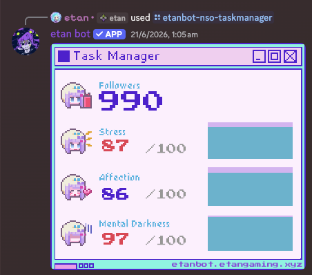
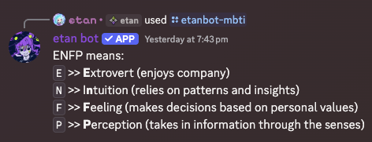
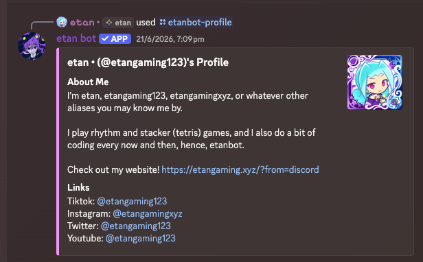

# etanbot

Funny Open Source Discord bot that can be added to your account and used anywhere within Discord. Has various commands, from fun, to utility, to cosmetic.

Profile Picture by Shoebill Studios.

[Website](https://etanbot.etangaming.xyz/ "etanbot website") • [Terms of Service](https://etanbot.etangaming.xyz/termsofservice.html "etanbot terms of service") • [Privacy Policy](https://etanbot.etangaming.xyz/privacypolicy.html "etanbot privacy policy")

[Add to your Discord](https://discord.com/oauth2/authorize?client_id=1505906056222605352 "Add etan bot to your Discord account") • [Discord Discovery Page](https://discord.com/discovery/applications/1505906056222605352 "etan bot's Discord Discovery Page")

> [!NOTE]
> Uptime of this bot is flaky.
> You are free to selfhost the bot and run it on your own bot account.

> [!WARNING]
> This bot is intended for self hosting. etangaming123 is not responsible for sensitive data on this bot being leaked.
> Features that require data being stored are 100% optional, and you may delete it at any time.

## Features

### Fun

These are fun commands and should not be taken seriously.

* 8-ball command
* Braincell count (or random number generator)
* Pizoelectric tiles copypasta ("Japan is turning footsteps into electricity! ⚡Using piezoelectric tiles, every step you take generates a small amount of energy. Millions of steps together can power LED lights and displays in busy places like Shibuya Station. A brilliant way to create a sustainable and smart city -- turning movement into clean, renewable energy 🌱💡")
* "Puppet" command (makes the bot say something!)
* Random number generator
* Random birthday message (for any user in a server/dm)
* Prediction (predicting when something will happen)
* Lie detector
* Tonetag searcher
* MBTI personality lookup
* Deretype lookup
* Slotmachine
* Random choice picker (picks a choice from a given list)

### Useful

Various utility commands.

* Link cleaner (removes *most* url trackers within links)
* (unnofficial) Linkage with Koko Amusement Cards (so you can see how much credit you have left, from the comfort of Discord)
* Calculator and unit conversion (cm to inches, kg to pounds, etc.)
* (unofficial) "linkage" with rngdle (get a user's latest roll)
* Timezone conversion
* Calculator and unit conversion

### Cosmetic

If you want to spice up your Discord experience, kinda!

* Built in profiles (for fun!)
* NEEDY STREAMER OVERLOAD Task Manager generator
* Preset GIFS to choose from

## Screenshots/Showcase







## Quickstart

Open [this link](https://discord.com/oauth2/authorize?client_id=1505906056222605352 "Add etan bot to your Discord account") to authorise the official instance of etan bot with your Discord account, and you're all good to go! You will be able to use commands in servers and in DMs with other people (if the bot is online).

Do note that if you lack the "External Apps" permission in servers, you will still be able to use etanbot's commands, however they will only be visible to you.

## Selfhosting

### You will need:

* A Discord bot
* Python (3.0 or above)
* The required Python libraries in `requirements.txt`

The following are optional, but recommended:

* A device capable of running the Python program for a while (if you plan on leaving the bot online most of the time)

### Discord Bot

1. Log on to the [Discord Developer Portal](https://discord.com/developers/applications "Leads you to the Discord Developer Portal").
2. Create a new application using the button on the top right.
3. Add a new app icon. This will be the bot's profile picture.
4. Under the Overview tab, click on "Bot", and reset the bot's token. Copy the new token and keep it somewhere, you'll need it later.
5. Go to the Installation tab, and make sure the installation context is set to "User Install". Select "Discord Provided Link" for the Install link, then copy the generated URL.
6. Paste the url into your favourite browser, and add the bot to your account.

Optional steps, for if you wish to add your bot to servers:

1. If you wish to add your bot to servers, go to the Installation tab, and select "Guild Install" as well.
2. Under "Default Install Settings", select "bot" from "Guild Install" (in the Scopes tab).
3. Re-open the Discord Provided Link - there should be an "Add to server" option.
4. You can now add your bot to servers.

### Python Code

Ensure you have everything with:
`git clone https://github.com/etangaming123/etanbot`

Get all the required modules with:
`pip install -r requirements.txt`

Then, create a `config.json` file in the same directory as `main.py` with the following content:

```json
{
	"token": "Your Discord Bot Token here",
	"poweruserid": "Your Discord User ID here (optional, for owner-only commands)"
}
```

You might want to change some items in `common.py` before starting!

Finally, run the bot with:
`python main.py`

Refresh your Discord client, and press `/` on your keyboard. You should see the bot's commands in the list, and you can start using it!

Do note that the program has to be continuously running for the bot to work. If you close the terminal or stop the program, the bot will go offline and become unusable until you run it again.

## License

etan bot is licenced under the **[MIT License](./LICENSE "Leads you to the license for this repository").**

All other assets, such as the bot profile picture and the NEEDY STREAMER OVERLOAD Task Manager, are not owned by etangaming123.
